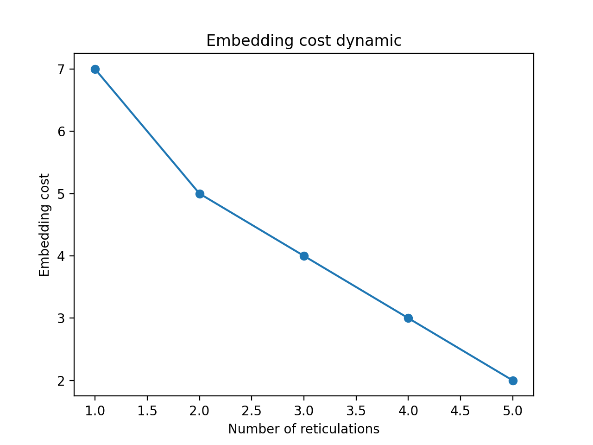

### Bioinformatics Supplemental
A supplemental reassortment network for the associated Bioinformatics manuscript is located in the `Bioinformatics_Supplemental` folder

## RF-Net 2
The RF-Net executables, supplemental scripts, and a test dataset are located in `RF-Net-2.zip`

### Overview
RF-Net is a method for estimation of entangled evolutionary histories of viruses or species. It reconstructs reassortment or hybridization networks from real, error-prone, biological data. RF-Net requires rooted gene/locus trees as an input.

### RF-Net execution
RF-Net requires Java 8 or higher for execution.
To run RF-Net, unpack RF-Net-2.zip in a desired location and execute it as

``java -jar RF-Net-2.0.jar -i <path/to/input/newick> -o <path/to/output/newick> [options]``

Note that it has to be executed from the same location, where you stored the .jar with dependencies.

### Options
For a full list of RF-Net options run `java -jar RF-Net-2.0.jar -h`.
* ``-r <#num>``: [Default: 5] Maximum number of reticulations (reassortments or hybridizations) in an output network.
* ``-f`` or ``--fast``: Dramatically advances the scalability of RF-Net. Should be used when many reassortment/hybridization events are anticipated (e.g., more that 10).
* ``-e`` or ``--embed``: Enables RF-Net to output error-corrected gene trees in addition to reticulation networks.
* ``-t <#percentage>``: Specifies an optional threshold for adding new reticulations (see more information on that option with `-h`). Example: `-t 5`.

**Usage example**:

``java -jar RF-Net-2.0.jar -i sample-dataset/IAV-delta1A-HANA.tre -o delta1A-network.newick -r 2 -e``

### RF-Net output
RF-Net writes the computed phylogenetic networks in the extended newick format to the specified output file. This output contains networks with 1, 2, ...  reticulations (up to the maximum number specified with `-r`, unless an additional threshold was specified with `-t`).

Additionally, if `-e` option was specified, RF-Net writes the *embeddings* of the gene trees (i.e., error-corrected gene trees) to `<output-file>.embeddings.tre`.

In the example above, RF-Net will write the two resulting networks with 1 and 2 reticulations, respectively, to `delta1A-network.newick`. The gene tree embeddings into the network with 2 reticulations will be written to `delta1A-network.newick.embeddings.tre`.

### Choosing the best network by visualizing the embedding cost
RF-Net uses the *embedding cost* as an optimization function. As RF-Net computes multiple networks (for different numbers of reticulations), we provide a pyhton script to visualize the dynamic of the embedding cost as the number of reticulations grows.

The script requires Python 3 and `matplotlib` and takes the RF-Net output file as an input.

For example, to find the proper number of reticulations for the IAV-delta1A-HANA.tre dataset, we can attempt the following:
1. ``java -jar RF-Net-2.0.jar -i sample-dataset/IAV-delta1A-HANA.tre -o delta1A-network.newick -r 5`` computes networks with up to 5 reticulations;
1. ``python3 plot_embedding_costs.py delta1A-network.newick`` then plots the embedding cost dynamic:

As the embedding cost only decreases by one after the first two reticulations, the plot suggests that 2 is the optimal number of reticulations, whereas a larger number of reticulations is likely to cause error-fitting.
